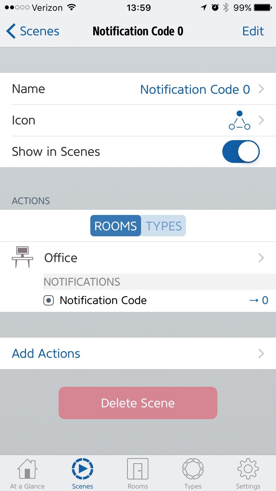
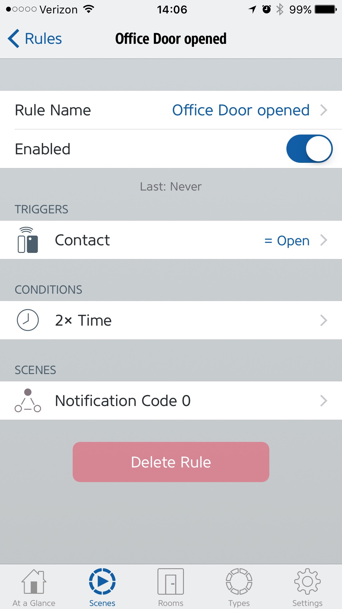

# homebridge-accessory-slack
A [slack](https://slack.com) accessory plugin for [Homebridge](https://github.com/nfarina/homebridge).

# Installation
Run these commands:

    % sudo npm install -g homebridge
    % sudo npm install -g homebridge-accessory-slack

On Linux, you might see this output for the second command:

    npm ERR! pcap2@3.0.4 install: node-gyp rebuild
    npm ERR! Exit status 1
    npm ERR!

If so, please try

    % apt-get install libpcap-dev

and try

    % sudo npm install -g homebridge-accessory-slack

again!

# Configuration
Edit `~/.homebridge/config`, inside `"accessories": [ ... ]` add:

    { "accessory"    : "slack"
    , "name"         : "Slack Notifications"
    , "webhook"      : "https://hooks.slack.com/services/.../.../..."
    , "codes"        : [ "Motion detected", "Door Opened" ]
    , "channel"      : "#homekit"
    , "username"     : "homekit"
    }

To create an incoming `webhook` for [slack](https://slack.com),
go to

        https://...slack.com/apps/A0F7XDUAZ-incoming-webhooks

and click on "Add Configuration",
this will provide a `webhook` URL such as the one in the example.

The `channel` and `username` properties are optional.

The `codes` array must contain at least one text string:
when you set `Notification Code` to an integer value,
the string residing at that offset in `codes` is sent as a notification.
Using the example above,
setting `Notification Code` to `0` results in "Motion detected" being sent.

For example,
here is a scene called 'Notification Code 0',
which does just that:

This can be combined with a rule called "Office Door opened",
that waits for a sensor contact to open at a certain time and then triggers that scene:

